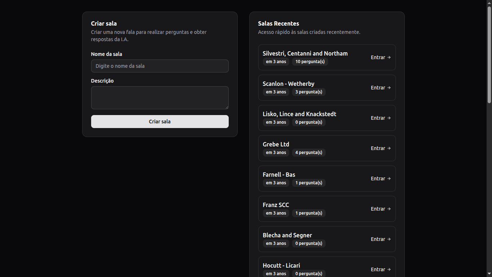
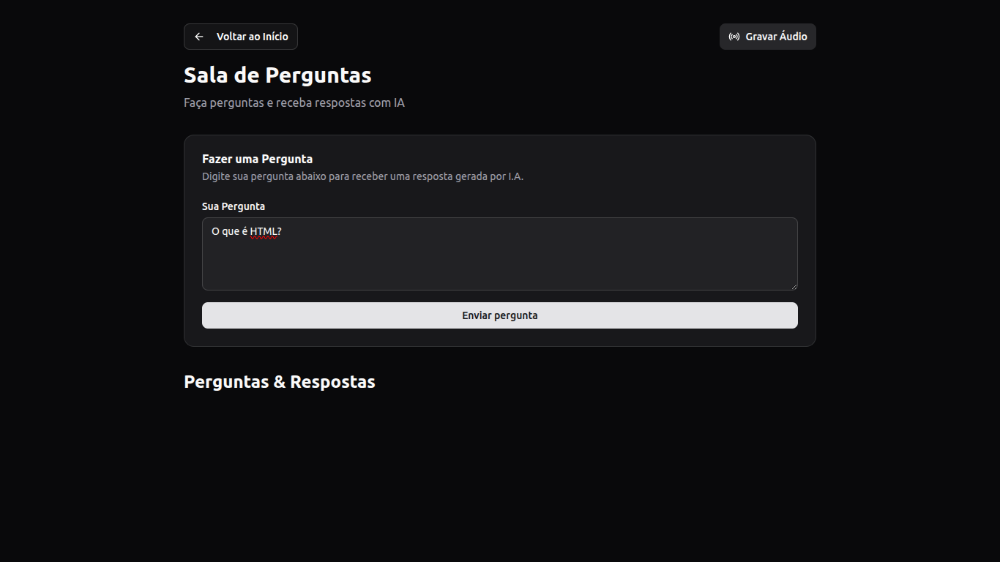
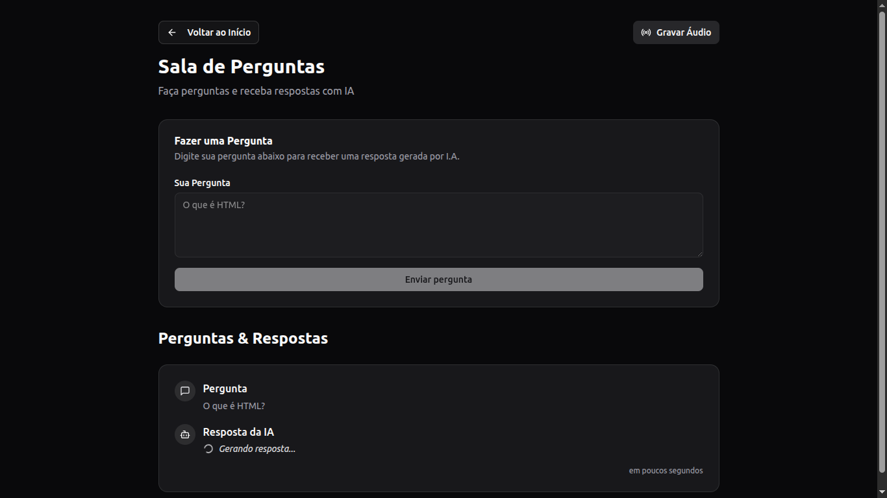
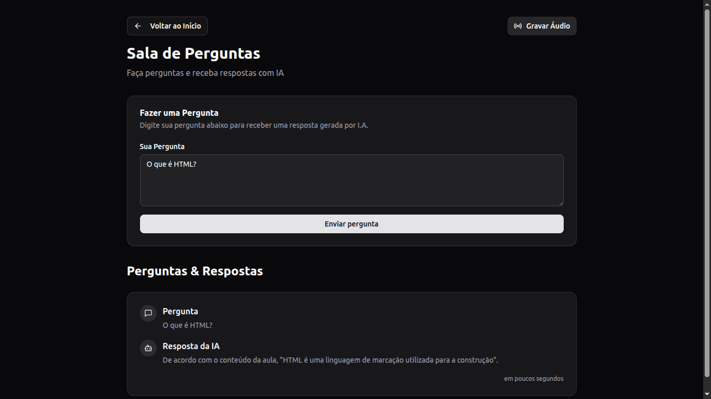

# Let Me Ask Web

A web app developed during NLW Agents by Rocketseat for live streams and broadcasts, which uses an AI agent to predict answers to questions in real time.

## Table of Contents

- [Technologies](#technologies)
- [Backend for Full Experience](#backend-for-full-experience)
- [Setup and Configuration](#setup-and-configuration)
  - [1. Prerequisites](#1-prerequisites)
  - [2. Clone this Repository](#2-clone-this-repository)
  - [3. Install Dependencies](#3-install-dependencies)
- [Running the Project](#running-the-project)
- [Screenshots](#screenshots)
- [Project Structure](#project-structure)
- [Author](#author)

## Technologies

This project was developed with the following stack:

- **React.js** – A JavaScript library for building fast and interactive user interfaces using a component-based architecture.
- **React Router DOM** – A flexible routing library for React applications, enabling declarative and dynamic navigation.
- **Vite** – A modern, lightning-fast build tool and development server optimized for frontend frameworks like React.
- **TypeScript** – A statically typed superset of JavaScript that enhances code quality, maintainability, and developer experience.
- **Tailwind CSS** – A utility-first CSS framework that enables rapid UI development with a consistent design system.
- **TanStack React Query** – A powerful data-fetching and server-state management library with built-in caching, background updates, and synchronization.
- **Shadcn UI** – A customizable and accessible component system built on top of Radix UI and Tailwind CSS.
- **Radix UI** – A low-level library of unstyled, accessible UI primitives for building high-quality components.
- **Lucide React** – An open-source icon library for React, featuring beautifully crafted and consistent icons.

## Backend for Full Experience

To get the full experience, you also need to run the backend API.

👉 Check out the API repository here: [Let Me Ask API](https://github.com/MarcosAntonio15243/let-me-ask-api)

The API handles:

- Creating and managing rooms
- Receiving and storing questions
- Generating real-time AI-based answers

## Setup and Configuration

Follow the steps below to run this project:

### 1. Prerequisites

To run this project, make sure you have the following installed and configured on your system:

- [Node.js](https://nodejs.org) (version 18+)
- [NPM](https://www.npmjs.com) or [Yarn](https://yarnpkg.com/)

### 2. Clone this Repository

Example using SSH:

```bash
git clone git@github.com:MarcosAntonio15243/let-me-ask-web.git
```

### 3. Install Dependencies

For this project and documentation tutorial, we will use the **NPM** package manager. To install the dependencies, run the following command at the root of the cloned repository:

```bash
npm install
```

## Running the Project

Start the development server:
  
```bash
npm run dev
```

Then access the application at `http://localhost:5173`.

## Screenshots

Here are some screenshots of the application in action:

<p align="center">
  
  <br>Main screen showing all available rooms and the card to create a new room.
</p>

<p align="center">
  
  <br>Room view displaying no questions at the moment.
</p>

<p align="center">
  
  <br>Room showing a submitted question that is waiting for an answer.
</p>

<p align="center">
  
  <br>Room displaying a question with its AI-generated answer.
</p>

<p align="center">
  
  <br>Audio recording interface within the room.
</p>

## Project Structure

The main folders and files in this project:

```
src/
│   ├── components/   → Reusable UI components
│   ├── http/         → HTTP client and API interaction
│   ├── lib/          → Utility functions and shared logic
│   └── pages/        → Application pages and routes
```

## Author

Made by [Marcos Antonio](https://github.com/MarcosAntonio15243).

- 💻 Full Stack developer dedicated to building complete solutions by combining modern, functional user interfaces with robust back-end architectures.
- 📚 This project represents my first experience using tools like **Drizzle ORM** and the **pgvector** extension, with a focus on AI-powered APIs based on multimedia content.
- 🚀 Always open to feedback, collaboration, or ideas for improvement!
- 📫 Feel free to connect with me on [LinkedIn](https://www.linkedin.com/in/marcos-antonio-18059b234) or check out more of my projects here on GitHub.